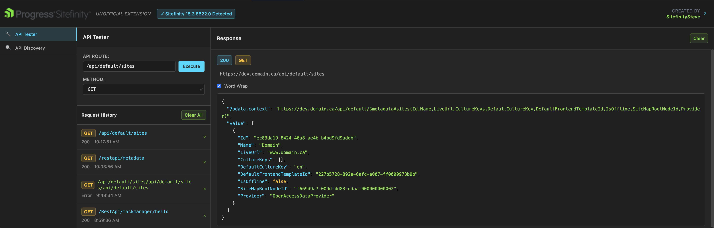
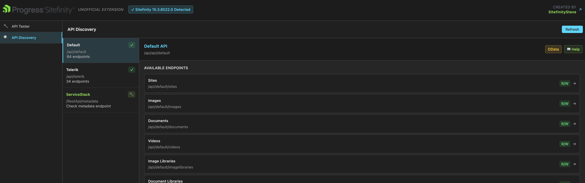
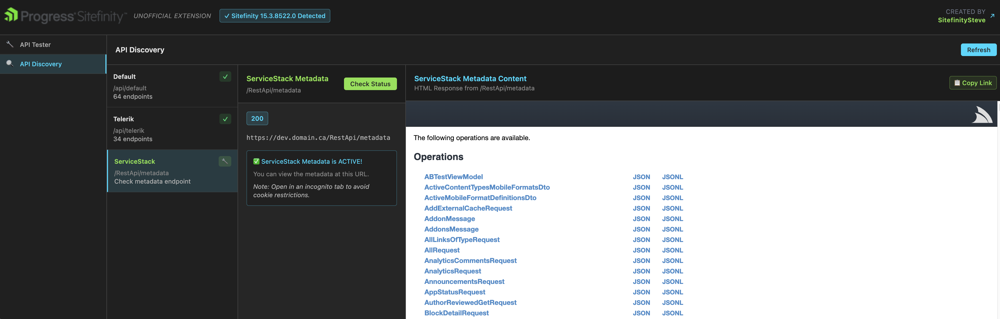

# Sitefinity Community Extension

An unofficial community extension for Sitefinity development tools built with Vue.js 3 and Tailwind CSS 4.

## Screenshots

### API Tester

*Test Sitefinity REST API endpoints with full HTTP method support, request history, and detailed response analysis*

### API Discovery

*Auto-discover available Sitefinity API endpoints with integrated help documentation and three-column layout*

### ServiceStack Integration

*Direct access to ServiceStack metadata with copy-to-clipboard URLs for incognito testing*

## Features

### API Testing Tools
- **API Tester**: Make HTTP requests to Sitefinity APIs with full HTTP method support (GET, POST, PUT, DELETE)
- **Request History**: Remembers last 10 unique requests with deduplication for easy re-use
- **Response Display**: View responses with JSON syntax highlighting and HTML rendering
- **Word Wrap Control**: Toggle word wrap on/off for long responses with proper scrollbar handling
- **URL Copy**: Click any response URL to copy to clipboard

### API Discovery
- **Automatic Discovery**: Auto-loads and displays available Sitefinity API endpoints
- **Three-Column Layout**: Browse APIs with integrated help documentation
- **ServiceStack Integration**: Direct access to ServiceStack metadata with copy-to-clipboard URLs
- **Help Documentation**: Inline help pages for each API endpoint

### Site Detection & Analysis  
- **Sitefinity Detection**: Automatically detects Sitefinity sites and versions
- **Site Information**: Displays detected Sitefinity version and site details
- **Status Indicators**: Clear visual indicators for Sitefinity vs non-Sitefinity sites

### User Experience
- **Chrome DevTools Integration**: Runs as a dedicated DevTools panel (not popup)
- **Vue DevTools Styling**: Professional dark theme matching Vue.js DevTools aesthetic
- **Responsive Design**: Adaptive layout that works across different screen sizes
- **Error Handling**: Detailed error reporting with HTTP status codes and descriptions

## Development

### Prerequisites

- Node.js 18+
- npm or yarn

### Setup

```bash
# Install dependencies
npm install

# Build for development (with file watching)
npm run watch

# Build for production
npm run build

# Development server (for component testing)
npm run dev
```

### Loading in Chrome

1. Run `npm run build` to create the `dist/` folder
2. Open Chrome and go to `chrome://extensions/`
3. Enable "Developer mode"
4. Click "Load unpacked" and select the `dist/` folder
5. Navigate to a Sitefinity site and open DevTools
6. Look for the "Sitefinity Community" tab

## Project Structure

```
src/
├── components/
│   ├── ApiTester/
│   │   ├── ApiTester.vue          # Main API testing interface
│   │   └── ResponsePanel.vue      # Response display with syntax highlighting
│   ├── ApiDiscovery.vue           # API endpoint discovery tool
│   └── Panel.vue                  # Main panel layout and site detection
├── background.js                  # Chrome extension background script
├── content.js                     # Content script for site detection
├── devtools.js                    # DevTools integration script
├── panel.html                     # Panel HTML template
└── style.css                      # Tailwind CSS configuration

tools/                             # Build and deployment tools
├── create-store-icon.js           # Generate 128x128 store icon
├── create-zip.js                  # Package extension for Chrome Web Store
└── resize-screenshots.js         # Resize screenshots to store requirements

assets/
├── store-screenshots/             # Chrome Web Store screenshots (1280x800)
│   ├── api-discovery.png
│   ├── api-tester-servicestack.png
│   └── api-tester.png
└── *.png                          # Original screenshots

dist/                              # Build output (auto-generated)
├── panel.html                     # Vue.js-powered DevTools panel
├── panel.js                       # Bundled Vue application
├── background.js                  # Service worker
├── content.js                     # Content script for site detection
├── devtools.js                    # DevTools entry point
└── manifest.json                  # Extension manifest

publish/                           # Deployment artifacts
└── sitefinity-community-extension.zip  # Ready for Chrome Web Store
```

## Chrome Web Store Deployment

### Option 1: Automated (Recommended)
```bash
npm run publish
```

This will:
1. Build the extension for production
2. Create `publish/sitefinity-community-extension.zip` ready for upload
3. Display next steps for Chrome Web Store submission

To create the store icon separately:
```bash
npm run create-icon
```

### Option 2: Manual
1. Run `npm run build`
2. Manually zip the entire `dist/` folder
3. Upload to Chrome Web Store Developer Dashboard

## Tech Stack

- **Vue.js 3** - Reactive UI framework with Composition API
- **Tailwind CSS 4** - Utility-first CSS framework with @theme directive
- **Vite** - Build tool and dev server with Chrome extension support
- **Chrome Extensions Manifest V3** - Extension API with DevTools integration
- **TypeScript** - Type checking and enhanced development experience

## Key Implementation Details

### Response Display Features
- **Source/Preview Toggle**: Switch between raw HTML source and rendered preview for HTML responses
- **JSON Syntax Highlighting**: Custom syntax highlighting without external dependencies
- **Sandboxed HTML Rendering**: HTML responses render in isolated iframes to prevent CSS conflicts
- **Overflow Management**: Proper scrollbar handling prevents panel expansion beyond boundaries

### API Integration
- **Cross-Origin Request Handling**: Uses X-Requested-With headers for proper CORS handling
- **Request Deduplication**: Intelligent history management prevents duplicate entries
- **Error Handling**: Comprehensive error reporting with HTTP status codes and descriptions
- **ServiceStack Support**: Special handling for ServiceStack metadata endpoints

### Security Considerations  
- **Content Security Policy**: Handles CSP restrictions for iframe content
- **Sandboxed Execution**: HTML preview runs in sandboxed environment
- **No External Dependencies**: Minimal attack surface with no external resource loading

## Created By

**SitefinitySteve**  
[www.sitefinitysteve.com](https://www.sitefinitysteve.com)

---

*This is an unofficial community extension and is not affiliated with Progress Software Corporation.*